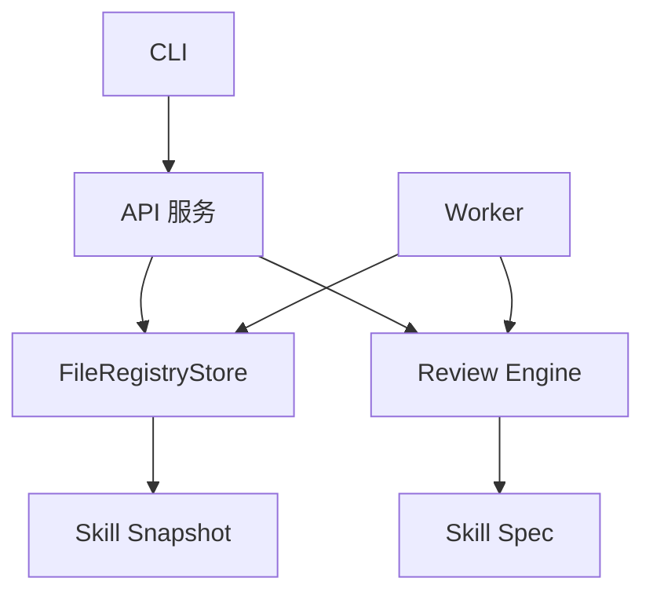

# Skill 管理平台架构设计

## 一期目标

Phase 0/1 的目标是交付一个可运行的可信 Skill 注册表雏形：用户可以通过 CLI 或 API 发布 Skill、触发审查、查询评分、下载安装版本。可视化、MCP、CI/CD 和多源同步在后续阶段迭代。

## 模块划分

## Monorepo 结构

- `apps/api`：HTTP API，提供健康检查、发布、搜索、详情、下载、审查查询。
- `apps/cli`：命令行入口，支持 `review`、`publish`、`search`、`info`、`install`。
- `apps/worker`：审查 Worker，可对待审版本重新执行审查。
- `packages/skill-spec`：Skill 包读取、frontmatter 解析、schema 校验、快照与 hash。
- `packages/review-engine`：格式合规、泄露风险、隐私风险、安全风险与基础功能性评分。
- `packages/storage`：注册表存储抽象。一期使用本地 JSON 文件，后续替换为 PostgreSQL + 对象存储。
- `docs/rules`：平台规范与审查规则。

## 数据流

1. CLI 读取本地 Skill 目录，生成不可变快照。
2. CLI 调用 API `POST /skills/publish` 上传快照。
3. API 使用审查引擎生成审查报告，并写入注册表。
4. 用户通过 `search`、`info` 查询元数据与评分。
5. 用户通过 `install` 下载快照，CLI 校验内容并写入目标目录。

## 存储策略

一期采用 `.data/registry.json` 保存注册表状态，便于快速开发和本地验证。数据结构保持接近未来服务端模型：

- `skills`：Skill 聚合根，按 `name` 唯一。
- `versions`：不可变版本，包含 manifest、hash、snapshot、review report、发布状态。
- `reviews`：每次审查的报告和 findings。

生产化时建议替换为：

- PostgreSQL：元数据、用户、组织、版本、评分、issue、审查报告。
- S3 兼容对象存储：Skill artifact、快照、审查日志。
- Redis/BullMQ：异步审查队列。
- OpenSearch/Meilisearch：搜索与榜单。

## 发布状态

- `draft`：已接收但尚未审查。
- `reviewing`：Worker 正在审查。
- `published`：审查通过，可安装。
- `needs-review`：存在中风险，需要人工复核。
- `rejected`：存在高危或严重问题，阻断发布。

## 安全边界

API 进程不执行 Skill 内脚本。一期审查只读取文件内容并进行静态检查。后续功能性评估必须进入隔离 Worker 或沙箱，限制网络、文件系统、环境变量和命令执行权限。
